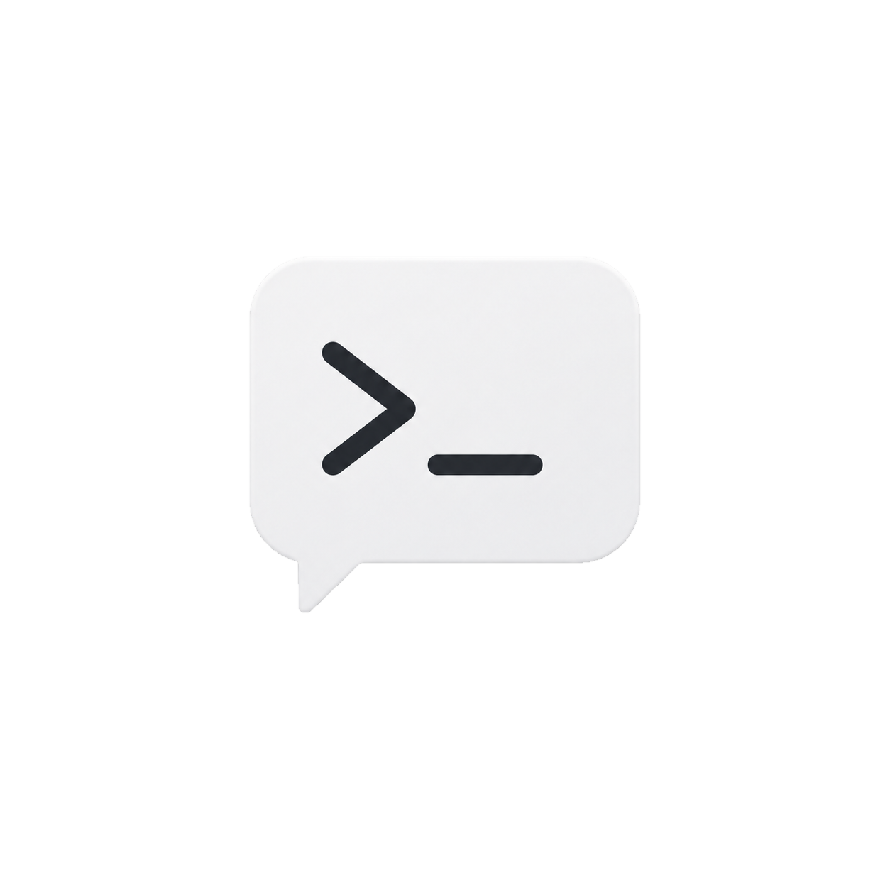
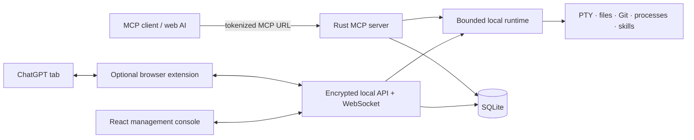

# ChatCMD

<p align="center">
  
</p>

<p align="center">
  Turn web-based AI into a local worker through the Model Context Protocol.
</p>

<p align="center">
  <a href="LICENSE"></a>
  <a href="Cargo.toml"></a>
  <a href="web/package.json"></a>
  <a href="https://modelcontextprotocol.io/"></a>
</p>

ChatCMD is a self-hosted bridge between MCP-compatible AI clients and your computer. It combines a Rust server, a permission-scoped machine runtime, SQLite persistence, a React management console, and an optional Chromium extension for working with ChatGPT in the browser.

The core application runs on your machine. It has no ChatCMD account, subscription, payment, quota, or hosted authentication dependency. Optional features can still make outbound connections—for example to ChatGPT, a Git repository used to install a skill, a Google Font, or a tunnel address that you configure.

> [!CAUTION]
> ChatCMD can expose terminals, files, Git repositories, and local processes to an AI client. Start with the smallest tool allowlist, keep approval mode enabled, review every public endpoint, and never publish a tokenized MCP URL.

## Why ChatCMD

- **Local-first runtime:** the server, management UI, task history, settings, and SQLite database stay on your device.
- **MCP access profiles:** create multiple plugin profiles, grant tools per profile, disable access without deleting the profile, and rotate secret URLs.
- **Real machine tools:** persistent PTY terminals, bounded file operations, Git commands, process inspection, task artifacts, and skill discovery.
- **Live supervision:** follow progress, tool calls, file changes, terminals, sub-agents, approvals, and final responses in real time.
- **ChatGPT web bridge:** optionally send, continue, queue, and stop ChatGPT browser conversations through a Manifest V3 extension.
- **Cross-platform codebase:** Windows, macOS, and Linux development/runtime support; release packaging scripts are included for Windows and macOS.
- **No vendor lock-in:** the server uses MCP Streamable HTTP and a documented local API rather than a proprietary hosted control plane.

## Features

### MCP and permissions

- Tokenized Streamable HTTP endpoints in the form `http://127.0.0.1:8080/mcp/<token>`.
- Separate access profiles for different AI clients or jobs.
- Per-tool allowlists, grouped permission controls, and a non-destructive preset.
- Enable, disable, edit, delete, and rotate access profiles.
- Origin and host validation, one-time local profile secrets hashed at rest, URL-token redaction in built-in HTTP traces, and rejection of query-string credentials.
- User-managed public domains, reverse proxies, IP addresses, and tunnels with a connectivity test before they are saved.

### Local tool catalog

| Group | Capabilities |
| --- | --- |
| Device | List and inspect the local execution device. |
| Terminal | Create, write, wait, read, signal, resize, list, inspect, and close persistent PTY sessions. |
| Files and workspace | Discover roots; list, find, search, read, create, replace, write, inspect, copy, move, and delete files or directories. |
| Git | Status, diff, log, branches, show revisions, and create commits without shell interpolation. |
| Processes | List, inspect, and terminate local processes or process trees. |
| Skills | Discover and read project or user skills from `.agents` and `.codex`. |
| Tasks and orchestration | Track user turns, progress, execution mode, artifacts, plan questions, sub-agents, waits, and completion. |

The authoritative method-by-method reference is in [docs/mcp_method.md](docs/mcp_method.md).

### Management console

- Runtime dashboard for app, database, MCP listener, task, terminal, approval, and client health.
- Project-aware task rail with search, pagination, rename, delete, unread counters, and workspace grouping.
- Rich task timeline with Markdown, tool output, syntax highlighting, file-change summaries, side-by-side diffs, sub-agent status, and stop controls.
- Conversation, activity, and plan-question approval queues.
- Interactive xterm.js terminal views with live output, input, resize, process ID, CPU, and memory information.
- Skill discovery, enable/disable controls, configurable skill options, GitHub repository preview, installation, and removal.
- English and Vietnamese UI, light/dark/system themes, configurable Google Fonts, task font scaling, and event sounds.
- SQLite diagnostics, application logs, extension logs, configurable data retention, and selective user-data cleanup.
- Windows/macOS system tray behavior and an optional elevated restart flow.

### ChatGPT browser bridge

The optional `chatgpt-extension/` package can use an already signed-in `chatgpt.com` tab to:

- start or continue a browser conversation from ChatCMD;
- choose a visible ChatGPT model label;
- queue, reorder, edit, send immediately, or delete follow-up messages;
- stop an active generation;
- relay final responses and conversation identity back to the local task;
- show local conversation, tool, and plan-question approvals in ChatGPT;
- provide a browser fallback for sub-agent work.

This extension is an unofficial DOM bridge, not the OpenAI API. ChatGPT UI changes may require selector updates. See [chatgpt-extension/README.md](chatgpt-extension/README.md) for its security model and limitations.

ChatCMD is an independent project and is not affiliated with or endorsed by OpenAI, ChatGPT, Cloudflare, or other third-party service providers. Their names and trademarks belong to their respective owners, and use of their services remains subject to their terms.

## Architecture



For component boundaries, data flow, and security assumptions, read [docs/ARCHITECTURE.md](docs/ARCHITECTURE.md).

## Requirements

- [Rust](https://www.rust-lang.org/tools/install) **1.85 or newer** with Cargo.
- [Node.js](https://nodejs.org/) **20.19 or newer**, or **22.12 or newer**, and npm (matching the checked-in Vite engine requirement).
- [Git](https://git-scm.com/).
- A supported local shell: PowerShell or `cmd.exe` on Windows; `bash` or `zsh` on macOS/Linux.
- Platform build tools:
  - Windows: Visual Studio Build Tools with the MSVC C++ workload.
  - macOS: Xcode Command Line Tools.
  - Linux: a C/C++ toolchain and the platform packages required by `winit`/`tray-icon` dependencies when building desktop targets.

## Quick start from source

```bash
git clone https://github.com/int04/ChatCmdClient.git
cd ChatCmdClient/web
npm ci
npm run build
cd ..
cargo run
```

Open <http://127.0.0.1:8080>. The first start creates and migrates the local SQLite database automatically.

For frontend hot reload, run the backend and Vite separately:

```bash
# Terminal 1, repository root
cargo run

# Terminal 2
cd web
npm ci
npm run dev
```

Then open <http://127.0.0.1:5173>. Vite proxies `/api` and `/ws` to the Rust server on port `8080`.

## Connect an MCP client

1. Open **Plugin list** in ChatCMD and select **Create new Plugin connection**.
2. Give the profile a recognizable name.
3. Select only the tool groups required for that client, then save the profile.
4. For a local MCP client, choose **Create new access code** from the profile menu and save the one-time endpoint immediately.
5. Add that URL as a Streamable HTTP MCP server in the client. No `Authorization` header is required; the secret is the final URL path segment.

To connect a web-hosted AI through your own public endpoint, follow [docs/PLUGIN_SETUP.md](docs/PLUGIN_SETUP.md). It covers tunnel/reverse-proxy setup, the ChatGPT developer-mode flow, and installation of the optional browser extension.

## Configuration

| Variable | Default | Purpose |
| --- | --- | --- |
| `CHATCMD_BIND` | `127.0.0.1` | Listener IP address. Keep loopback unless you understand the exposure and origin-policy consequences. |
| `CHATCMD_PORT` | `8080` | HTTP, MCP, API, UI, and WebSocket port. |
| `CHATCMD_DB_PATH` | Platform data directory | Override the SQLite database path. |
| `CHATCMD_WEB_DIST` | `web/dist` | Use a different built frontend directory for non-embedded development builds. |
| `CHATCMD_LOG_PATH` | `logs/chatcmd.log` | Override the append-only diagnostic log path. |
| `CHATCMD_FINALIZATION_GRACE_SECONDS` | `120` | Auto-finalization grace period, clamped to 30–3,600 seconds. |
| `CHATCMD_BUILD_VERSION` | Cargo package version | Version embedded into a build or release package. |
| `RUST_LOG` | `chat_cmd_client=info,tower_http=info` | Configure Rust tracing filters. |

Default database locations:

- Windows: `%LOCALAPPDATA%\ChatCmdClient\data\chatcmd.db`
- macOS: `~/Library/Application Support/ChatCmdClient/chatcmd.db`
- Linux: `$XDG_DATA_HOME/chatcmd-client/chatcmd.db`, or `~/.local/share/chatcmd-client/chatcmd.db`

Startup is idempotent. After a restart, stale running tasks and terminal sessions are marked interrupted.

## Build release artifacts

Create a standalone binary with the frontend embedded:

```bash
cd web
npm ci
npm run build
cd ..
cargo build --release --features embedded-web
```

Maintainers can use the packaging scripts:

```powershell
# Windows x64 and x86
.\scripts\build-windows.ps1 -Version 0.1.0
```

```bash
# macOS Apple Silicon and Intel
CHATCMD_BUILD_VERSION=0.1.0 ./scripts/build-macos.sh
```

The macOS script supports `MACOS_SIGN_IDENTITY` and `MACOS_NOTARY_PROFILE`. Full release instructions are in [docs/RELEASING.md](docs/RELEASING.md).

## Verify a change

```bash
cargo fmt --all -- --check
cargo check --workspace --all-targets
cargo test --workspace
cargo clippy --workspace --all-targets -- -D warnings

cd web
npm ci
npm run lint
npm test -- --run
npm run build

cd ../chatgpt-extension
node --test content-chatgpt.test.cjs
```

See [docs/DEVELOPMENT.md](docs/DEVELOPMENT.md) for the contributor workflow and narrower test commands.

## Screenshots

### Runtime overview

### Tasks and real-time activity

### Plugin access profiles

### Interactive terminals

### Skills management

### Settings and diagnostics

## Security and privacy

- Treat every MCP URL as a password. The full tokenized URL can grant the profile's permissions to anyone who has it.
- Local profile secrets are stored as hashes. Public plugin-link tokens are stored in the local SQLite database in recoverable plaintext so ChatCMD can copy the same link again; protect the database with operating-system account and disk controls.
- Prefer loopback binding and an authenticated, HTTPS tunnel or reverse proxy for remote access.
- The local management API requires a trusted caller marker and encrypts JSON bodies; the WebSocket uses an ephemeral ECDH-derived AES-GCM session. This is defense in depth, not protection from the owner of a compromised browser or machine.
- The extension has no cookie permission and does not read or write ChatGPT login tokens, but it can interact with the signed-in ChatGPT page through its DOM.
- Review [SECURITY.md](SECURITY.md) before reporting a vulnerability. Do not place secrets or private data in a public issue.

## Documentation

- [Documentation index](docs/README.md)
- [Plugin and ChatGPT setup](docs/PLUGIN_SETUP.md)
- [Architecture](docs/ARCHITECTURE.md)
- [Development guide](docs/DEVELOPMENT.md)
- [Open-source publication checklist](docs/OPEN_SOURCE_CHECKLIST.md)
- [MCP method reference](docs/mcp_method.md)
- [Troubleshooting](docs/TROUBLESHOOTING.md)
- [Encryption protocol](docs/ENCRYPTION_PROTOCOL.md)
- [Diagnostic logs](docs/logs.md)
- [Release guide](docs/RELEASING.md)

## Contributing

Contributions are welcome. Read [CONTRIBUTING.md](CONTRIBUTING.md), the [Code of Conduct](CODE_OF_CONDUCT.md), and [GOVERNANCE.md](GOVERNANCE.md) before opening a pull request. Use [SUPPORT.md](SUPPORT.md) to choose the right support channel.

## License

ChatCMD is available under the [MIT License](LICENSE). You may use, copy, modify, distribute, sublicense, and sell copies, including as part of commercial products, subject to the license notice and warranty disclaimer.

Third-party dependencies, services, trademarks, and bundled media remain subject to their own licenses and terms.

Copyright © 2026 Nghia Duc and ChatCMD contributors.
