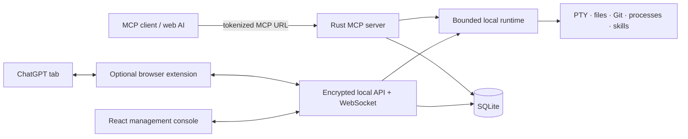
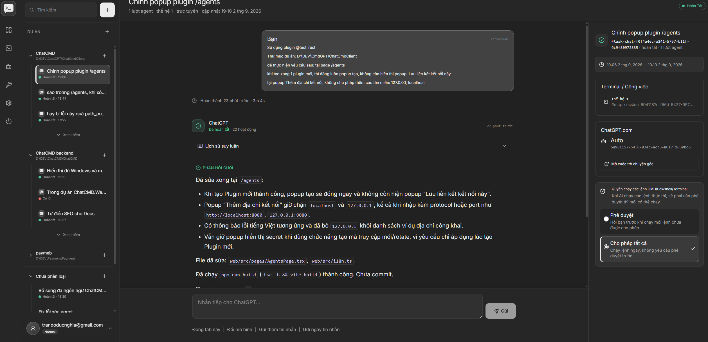
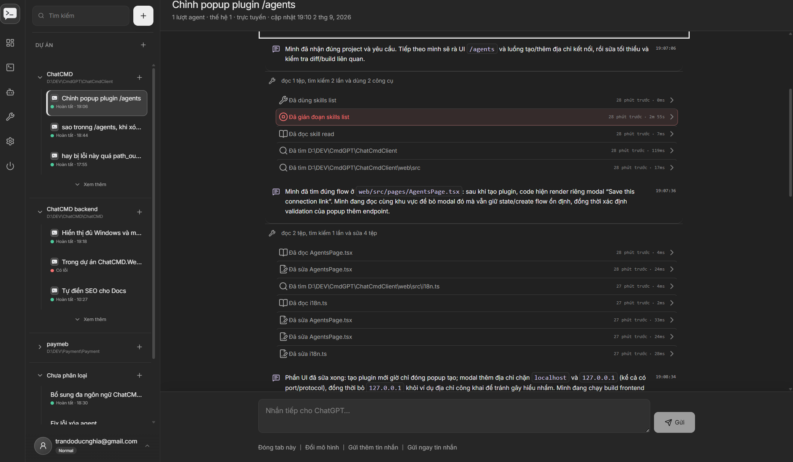
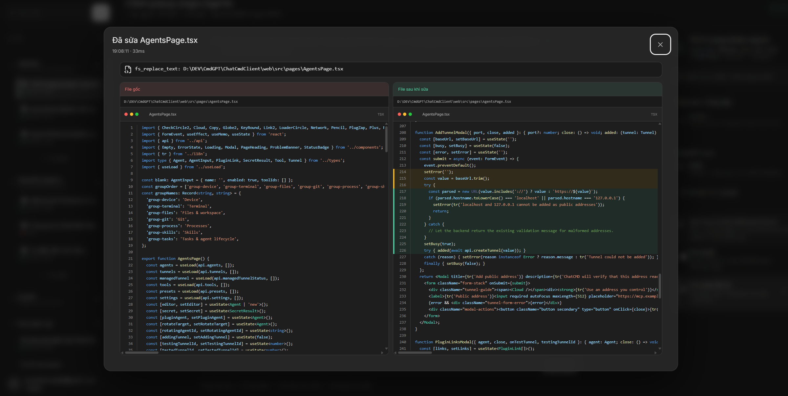
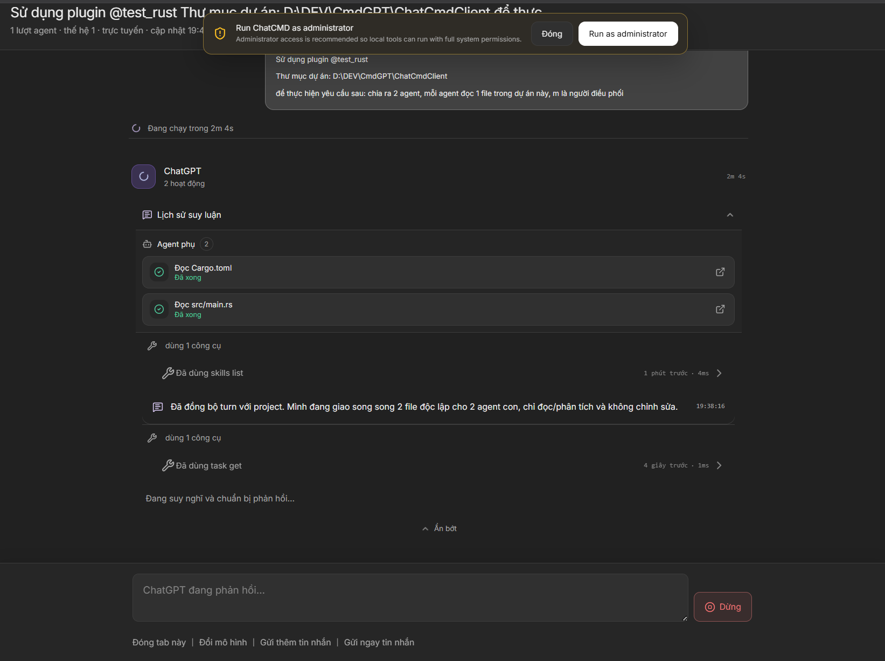
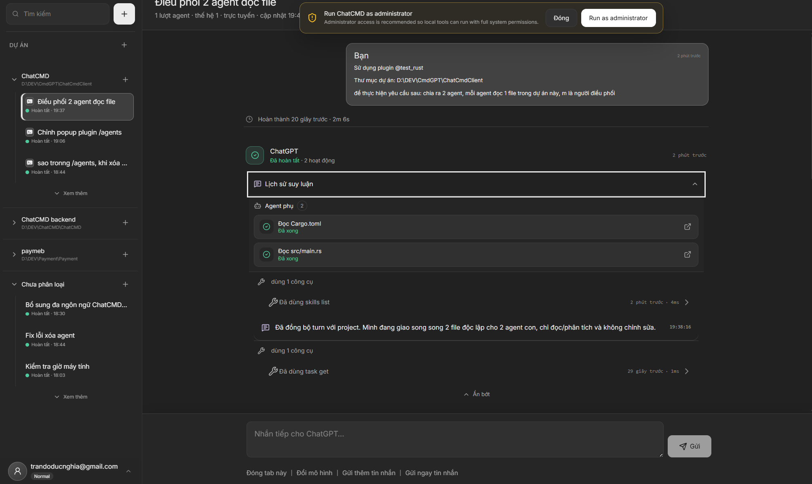
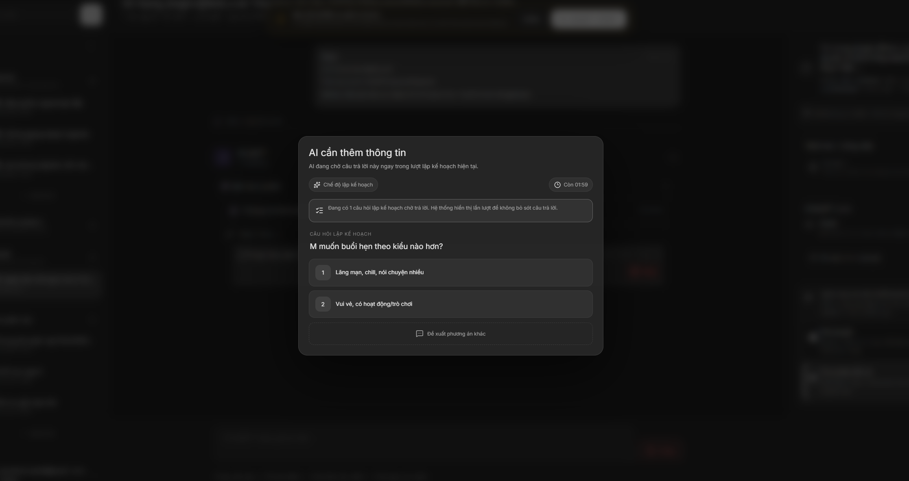
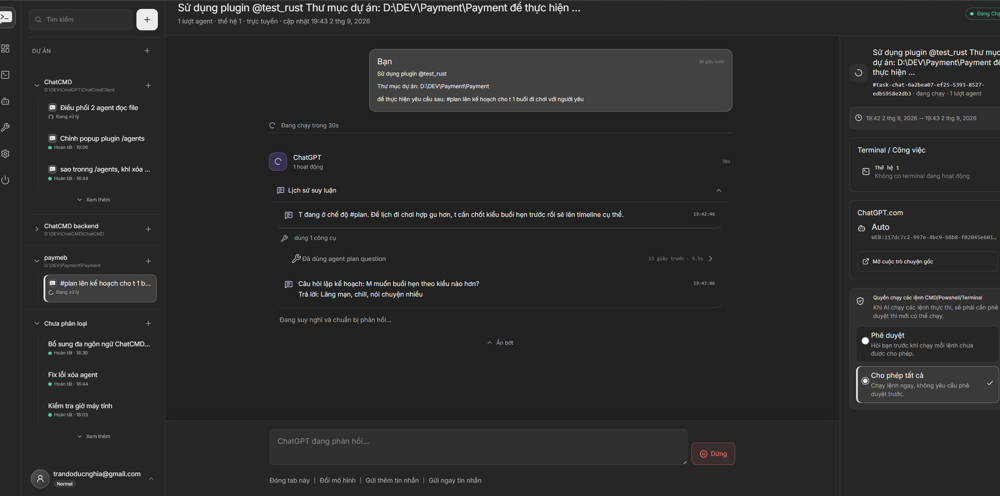
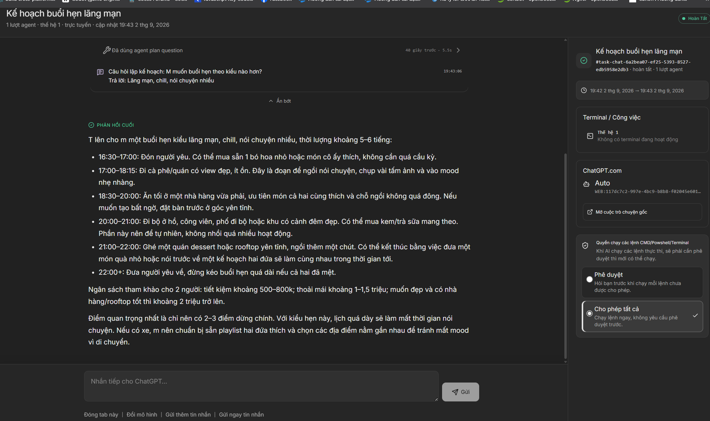

# ChatCMD

<p align="center">
  
</p>

<p align="center">
  Biến AI chạy trên nền web thành một worker cục bộ thông qua Model Context Protocol.
</p>

<p align="center">
  <a href="LICENSE"></a>
  <a href="Cargo.toml"></a>
  <a href="web/package.json"></a>
  <a href="https://modelcontextprotocol.io/"></a>
</p>

ChatCMD là một cầu nối tự host giữa các AI client tương thích MCP và máy tính của bạn. Dự án kết hợp một server Rust, runtime thao tác máy có giới hạn quyền, SQLite để lưu trạng thái, giao diện quản trị React và một Chromium extension tùy chọn để làm việc với ChatGPT trong trình duyệt.

Ứng dụng lõi chạy trực tiếp trên máy của bạn. ChatCMD không yêu cầu tài khoản ChatCMD, subscription, thanh toán, quota hay hệ thống xác thực hosted. Một số tính năng tùy chọn vẫn có thể kết nối ra ngoài, ví dụ ChatGPT, Git repository dùng để cài skill, Google Font hoặc tunnel address do bạn cấu hình.

## Tải bản phát hành mới nhất

<p>
  <a href="https://github.com/int04/ChatCmd/releases/latest/download/ChatCMD-windows-x64.zip"></a>
  <a href="https://github.com/int04/ChatCmd/releases/latest/download/ChatCMD-windows-x86.zip"></a>
</p>
<p>
  <a href="https://github.com/int04/ChatCmd/releases/latest/download/ChatCMD-macos-apple-silicon.zip"></a>
  <a href="https://github.com/int04/ChatCmd/releases/latest/download/ChatCMD-macos-intel.zip"></a>
</p>

[Xem ghi chú phát hành và mã SHA-256](https://github.com/int04/ChatCmd/releases/latest).

Các gói macOS được build tự động hiện dùng ad-hoc signing và chưa được Apple notarize.

> [!CAUTION]
> ChatCMD có thể cho AI client quyền truy cập terminal, file, Git repository và process cục bộ. Hãy bắt đầu với allowlist tool nhỏ nhất có thể, giữ chế độ phê duyệt bật, kiểm tra kỹ mọi public endpoint và tuyệt đối không công khai MCP URL có token.

## Vì sao chọn ChatCMD

- **Runtime ưu tiên local:** server, UI quản trị, lịch sử task, settings và SQLite database đều nằm trên thiết bị của bạn.
- **MCP access profile:** tạo nhiều plugin profile, cấp tool theo từng profile, vô hiệu hóa quyền truy cập mà không cần xóa profile và xoay vòng secret URL.
- **Tool thao tác máy thật:** terminal PTY lâu dài, thao tác file có giới hạn, Git command, kiểm tra process, task artifact và skill discovery.
- **Giám sát trực tiếp:** theo dõi progress, tool call, thay đổi file, terminal, sub-agent, approval và phản hồi cuối theo thời gian thực.
- **ChatGPT web bridge:** tùy chọn gửi, tiếp tục, xếp hàng và dừng hội thoại ChatGPT trong trình duyệt thông qua Manifest V3 extension.
- **Codebase đa nền tảng:** hỗ trợ phát triển/runtime trên Windows, macOS và Linux; có sẵn script đóng gói release cho Windows và macOS.
- **Không bị khóa vào một vendor:** server dùng MCP Streamable HTTP và local API có tài liệu thay vì một hosted control plane độc quyền.

## Tính năng

### MCP và phân quyền

- Streamable HTTP endpoint có token dạng `http://127.0.0.1:8080/mcp/<token>`.
- Tách riêng access profile cho từng AI client hoặc từng loại công việc.
- Allowlist theo từng tool, nhóm quyền và preset không phá hủy cấu hình.
- Bật, tắt, chỉnh sửa, xóa và rotate access profile.
- Kiểm tra origin và host, secret profile local chỉ hiển thị một lần và được hash khi lưu, ẩn URL token trong HTTP trace tích hợp và từ chối credential đặt trong query string.
- Cho phép người dùng tự quản lý public domain, reverse proxy, IP address và tunnel, kèm kiểm tra kết nối trước khi lưu.

### Danh mục tool cục bộ

| Nhóm | Khả năng |
| --- | --- |
| Thiết bị | Liệt kê và kiểm tra thiết bị thực thi cục bộ. |
| Terminal | Tạo, ghi, chờ, đọc, gửi signal, resize, liệt kê, kiểm tra và đóng các PTY session lâu dài. |
| File và workspace | Tìm root; liệt kê, tìm, search, đọc, tạo, thay thế, ghi, kiểm tra, copy, move và xóa file hoặc thư mục. |
| Git | Status, diff, log, branch, xem revision và tạo commit không qua shell interpolation. |
| Process | Liệt kê, kiểm tra và terminate process hoặc cả process tree cục bộ. |
| Skills | Khám phá và đọc project/user skill trong `.agents` và `.codex`. |
| Task và orchestration | Theo dõi user turn, progress, execution mode, artifact, plan question, sub-agent, wait và completion. |

Tài liệu chuẩn theo từng method nằm tại [docs/mcp_method.md](docs/mcp_method.md).

### Điều phối Sub-Agent

Sub-Agent cho phép một coordinator chia một task lớn thành các phần việc nhỏ hơn để xử lý độc lập và, khi phù hợp, chạy song song. Mỗi Sub-Agent có child task riêng nhưng vẫn gắn với parent task và root turn, nhờ đó ChatCMD có thể giám sát toàn bộ cây delegation trong cùng một workflow.

Đặt số lượng Sub-Agent lớn hơn `0` là opt-in có cấu trúc: model tự quyết định từ ý nghĩa yêu cầu và đặc điểm task xem delegation có hữu ích hay không. ChatCMD không phân loại nội dung user message và không yêu cầu từ khóa ở bất kỳ ngôn ngữ nào. Đặt về `0` để tắt việc tạo Agent con mới.

Cơ chế hoạt động:

1. **Giao một phần việc rõ ràng.** Parent tạo mới hoặc reuse child qua `agent_subagent_start`, kèm tên, yêu cầu, context phạm vi tùy chọn như file, effect, dependency, acceptance criteria và project context, cùng safe-read approval grant có giới hạn nếu phù hợp.
2. **Đặt chỗ và claim child task.** ChatCMD tạo child task cùng Sub-Agent run theo ID xác định, ngăn worker trùng lặp cho cùng một delegation và áp dụng giới hạn concurrency Sub-Agent toàn cục trong **Settings > Execution**.
3. **Giữ nguyên ranh giới an toàn.** Delegation không mở rộng policy của server. Các field context như `allowedFiles` và `allowedEffects` hướng dẫn phạm vi cho child nhưng tự chúng không cấp quyền hoặc tạo sandbox phía server. Tool authorization, workspace/path policy, execution approval, lifecycle, cancellation và resource budget thông thường vẫn áp dụng. `approvalGrant` tùy chọn chỉ có thể kế thừa một phần có giới hạn từ safe-read grant đã được user duyệt của parent; Git, process, write và agent-lifecycle operation vẫn đi qua cơ chế approval bình thường.
4. **Hỗ trợ delegation lồng nhau mà không deadlock.** Child có thể tạo Sub-Agent riêng, vì vậy các flow parent → child → grandchild được hỗ trợ. Tất cả descendant dùng chung global concurrency budget; nếu nested child không còn slot, nó phải tự làm phần việc đó cục bộ thay vì chờ vô thời hạn.
5. **Giám sát lifecycle và lỗi.** Sub-Agent chạy qua các trạng thái pending/running/terminal, phát status trực tiếp lên task timeline, gia hạn lease bằng heartbeat và được watchdog dọn dẹp nếu worker restart, mất heartbeat hoặc vượt runtime deadline. ChatGPT browser extension cũng có thể làm fallback worker khi native delegation không khả dụng.
6. **Trả kết quả bền vững về coordinator.** `agent_subagent_wait` chờ toàn bộ descendant tree và đọc final report đã persist trong SQLite, bao gồm cả grandchild. Report chứa nội dung cuối, work outcome đã chuẩn hóa, blocker, limitation, child verification metadata và evidence reference. Lifecycle completion được tách biệt với bằng chứng rằng delegated objective thực sự thành công, vì vậy parent vẫn chịu trách nhiệm tích hợp và kiểm tra lại công việc của child trước khi finalize.

Sub-Agent đặc biệt hữu ích khi cần chia code inspection chạy song song, tách nghiên cứu theo component, giao implementation/review có phạm vi rõ ràng hoặc xây workflow agent nhiều tầng mà vẫn giữ được task history, permission boundary và khả năng truy vết kết quả cuối. Xem [docs/subagent-reports.md](docs/subagent-reports.md) và [docs/subagent-approval-grants.md](docs/subagent-approval-grants.md) để biết chi tiết về report và permission model.

### Tin nhắn tiếp theo: xếp hàng hoặc gửi ngay

Trong khi ChatGPT vẫn đang xử lý, ChatCMD cho phép bạn chuẩn bị instruction tiếp theo mà không cần đợi response hiện tại hoàn tất. Task composer có hai chế độ gửi khác nhau:

- **Gửi thêm tin nhắn:** đưa message vào hàng đợi ChatGPT bền vững của task. ChatCMD giữ message ở trạng thái chờ cho đến khi conversation hiện tại idle, browser bridge đã kết nối, đúng tab ChatGPT đang mở và UI sẵn sàng nhận prompt mới; sau đó message đầu tiên trong queue sẽ được gửi tự động.
- **Gửi ngay tin nhắn:** đánh dấu message là `immediate`, cho phép AI nhận nó ở MCP call kế tiếp trong cùng conversation thay vì phải đợi cửa sổ gửi qua browser bình thường. Nếu active turn kết thúc trước thời điểm đó, message vẫn được giữ lại như một queued follow-up thông thường thay vì bị mất.

Các follow-up đang xếp hàng có thể quản lý trực tiếp trên task UI: đổi thứ tự, sửa, xóa, nâng từ queued lên immediate hoặc hạ từ immediate về queue bình thường. Realtime queue event giữ panel luôn đồng bộ khi message được consume, và auto-send sẽ tạm dừng trong lúc compact/resume, bridge synchronization, một send khác hoặc một edit đang diễn ra.

Tính năng này hữu ích khi bạn đã biết bước tiếp theo cần làm: có thể xếp sẵn nhiều instruction để thực hiện tuần tự hoặc chèn một instruction ưu tiên cao vào MCP workflow hiện tại mà không cần ngồi chờ từng ChatGPT turn sẵn sàng.

### Thu gọn và tiếp tục ngay

Các hội thoại ChatGPT dài dần sẽ khó tiếp tục ổn định khi usable context gần đầy. **Thu gọn và tiếp tục ngay** tạo một handoff bền vững từ conversation hiện tại sang một conversation mới, đồng thời vẫn giữ nguyên ChatCMD task, project, permission, timeline, queued message và local task identity.

Cơ chế hoạt động:

1. **Luôn xác nhận trước khi gửi bất cứ thứ gì.** Chọn **Thu gọn và tiếp tục ngay** sẽ mở confirmation dialog. Checkbox tùy chọn **Tiếp tục công việc sau khi compact xong** luôn mặc định chưa chọn mỗi lần mở; để trống nếu chỉ muốn chuyển context, hoặc bật lên nếu muốn tự động tiếp tục công việc sau khi replacement chat được attach.
2. **Đóng băng task tại một ranh giới an toàn.** ChatCMD chặn local MCP operation mới trên task đang compact, đợi các operation đã được admit chạy xong và dừng generation ChatGPT hiện tại trước khi yêu cầu source conversation tạo handoff. Draft hiện có và queued follow-up message vẫn được giữ nguyên, không bị ghi đè.
3. **Viết và persist handoff trước.** Source ChatGPT conversation nhận một structured handoff request bao gồm requirement, correction, trạng thái completed so với planned, chuỗi bug/fix/evidence, delegated work, environment detail, blocker và task còn lại. Public answer tạo ra được lưu bền vững trong SQLite trước khi ChatCMD được phép mở hoặc commit replacement conversation.
4. **Bootstrap một ChatGPT conversation mới.** ChatCMD mở conversation mới và gửi no-tools resume/bootstrap message chứa handoff đã lưu. Hệ thống đợi đến khi quan sát được canonical ChatGPT conversation identity thực tế cùng resume marker của destination trước khi thay đổi active conversation binding của task.
5. **Giữ nguyên một ChatCMD task.** Khi hoàn tất, hệ thống archive URL và conversation metadata cũ, retire các bridge binding đã lỗi thời và trỏ task hiện có sang conversation mới. Task ID, title, project folder, permission state, timeline, draft và queued message vẫn thuộc task ban đầu thay vì tạo thêm một ChatCMD task thứ hai.
6. **Tùy chọn tiếp tục công việc.** Chỉ khi opt-in đã lưu được bật, ChatCMD mới enqueue deterministic post-handoff continuation request. Các resume call lặp lại là idempotent nên recovery hoặc retry không tạo working message trùng.
7. **Đóng source tab một cách bảo thủ.** Sau khi conversation mới đã attach an toàn, ChatCMD chỉ cố đóng đúng source tab đã ghi nhận. Nếu tab identity, draft state, generation state hoặc dispatch ownership còn mơ hồ, hệ thống giữ tab đó mở thay vì mạo hiểm đóng nhầm conversation.

UI hiển thị trực tiếp các phase: chuẩn bị, viết handoff, lưu handoff và mở chat mới. Compact state được persist độc lập với browser worker, vì vậy extension reload, tab đóng/mở lại, Send enable chậm hoặc response thất lạc đều có thể reconcile từ SQLite kết hợp browser dispatch metadata thay vì gửi lại prompt một cách mù quáng. Các lần compact hoàn tất vẫn xuất hiện trong **Lịch sử thu gọn ngữ cảnh**, kèm reference tới source conversation đã archive và replacement conversation.

Tính năng thu gọn và tiếp tục được thiết kế theo nguyên tắc fail-closed: nếu ChatCMD không thể chứng minh prompt nào đã được gửi, conversation nào đã tạo handoff hoặc destination nào đang sở hữu resume marker, hệ thống sẽ dừng ở trạng thái có thể recovery thay vì âm thầm làm mất context hoặc bind task vào sai chat. Xem [docs/COMPACT_RESUME.md](docs/COMPACT_RESUME.md) để biết đầy đủ persistence, identity, recovery và dispatch model.

### Giao diện quản trị

- Bảng điều khiển hệ thống cho ứng dụng, cơ sở dữ liệu, MCP listener, tác vụ, terminal, phê duyệt và trạng thái client.
- Task rail hiểu project, có search, pagination, rename, delete, unread counter và nhóm theo workspace.
- Task timeline giàu thông tin với Markdown, tool output, syntax highlighting, file-change summary, side-by-side diff, trạng thái sub-agent và stop control.
- Hàng đợi approval cho conversation, activity và plan question.
- Giao diện terminal xterm.js tương tác trực tiếp với output, input, resize, process ID, CPU và memory information.
- Skill discovery, bật/tắt skill, option có thể cấu hình, preview GitHub repository, cài đặt và gỡ bỏ.
- UI tiếng Anh và tiếng Việt, light/dark/system theme, Google Font tùy chỉnh, scale font của task và event sound.
- SQLite diagnostics, application log, extension log, data retention tùy chỉnh và selective user-data cleanup.
- System tray trên Windows/macOS và flow restart với quyền elevated tùy chọn.

### Cầu nối trình duyệt ChatGPT

Package `chatgpt-extension/` tùy chọn có thể sử dụng tab `chatgpt.com` đã đăng nhập sẵn để:

- bắt đầu hoặc tiếp tục hội thoại trên trình duyệt từ ChatCMD;
- chọn model label đang hiển thị trên ChatGPT;
- queue, reorder, edit, gửi ngay hoặc xóa follow-up message;
- dừng generation đang chạy;
- chuyển tiếp phản hồi cuối và danh tính hội thoại về tác vụ cục bộ;
- hiển thị approval cho local conversation, tool và plan question ngay trong ChatGPT;
- cung cấp browser fallback cho công việc Sub-Agent.

Extension này là DOM bridge không chính thức, không phải OpenAI API. Thay đổi UI ChatGPT có thể yêu cầu cập nhật selector. Xem [chatgpt-extension/README.md](chatgpt-extension/README.md) để biết security model và limitation.

ChatCMD là dự án độc lập, không liên kết và không được OpenAI, ChatGPT, Cloudflare hoặc các nhà cung cấp dịch vụ bên thứ ba khác chứng thực. Tên và nhãn hiệu thuộc về chủ sở hữu tương ứng, và việc sử dụng các dịch vụ đó vẫn chịu sự điều chỉnh bởi điều khoản của họ.

## Kiến trúc



Để xem ranh giới giữa các component, data flow và security assumption, đọc [docs/ARCHITECTURE.md](docs/ARCHITECTURE.md).

## Yêu cầu hệ thống

- [Rust](https://www.rust-lang.org/tools/install) **1.85 trở lên** cùng Cargo.
- [Node.js](https://nodejs.org/) **20.19 trở lên**, hoặc **22.12 trở lên**, và npm (khớp với Vite engine requirement đã được commit).
- [Git](https://git-scm.com/).
- Shell cục bộ được hỗ trợ: PowerShell hoặc `cmd.exe` trên Windows; `bash` hoặc `zsh` trên macOS/Linux.
- Build tool theo nền tảng:
  - Windows: Visual Studio Build Tools với MSVC C++ workload.
  - macOS: Xcode Command Line Tools.
  - Linux: C/C++ toolchain và các package hệ thống cần thiết cho dependency `winit`/`tray-icon` khi build desktop target.

## Chạy nhanh từ source

```bash
git clone https://github.com/int04/ChatCmd.git
cd ChatCmd/web
npm ci
npm run build
cd ..
cargo run
```

Mở <http://127.0.0.1:8080>. Lần chạy đầu tiên sẽ tự tạo và migrate SQLite database cục bộ.

Để hot reload frontend, chạy backend và Vite riêng:

```bash
# Terminal 1, repository root
cargo run

# Terminal 2
cd web
npm ci
npm run dev
```

Sau đó mở <http://127.0.0.1:5173>. Vite proxy `/api` và `/ws` sang Rust server ở port `8080`.

## Kết nối một MCP client

1. Mở **Danh sách plugin** trong ChatCMD và chọn **Tạo kết nối plugin mới**.
2. Đặt cho profile một tên dễ nhận biết.
3. Chỉ chọn các nhóm tool mà client đó thực sự cần, sau đó lưu profile.
4. Với MCP client cục bộ, chọn **Tạo mã truy cập mới** từ menu của profile và lưu endpoint dùng một lần ngay lập tức.
5. Thêm URL đó vào client dưới dạng Streamable HTTP MCP server. Không cần header `Authorization`; secret chính là segment cuối của URL path.

Để kết nối một AI chạy trên web qua public endpoint của riêng bạn, làm theo [docs/PLUGIN_SETUP.md](docs/PLUGIN_SETUP.md). Tài liệu này bao gồm cấu hình tunnel/reverse proxy, flow ChatGPT developer mode và cài đặt browser extension tùy chọn.

## Cấu hình

| Biến | Mặc định | Mục đích |
| --- | --- | --- |
| `CHATCMD_BIND` | `127.0.0.1` | IP listener. Nên giữ loopback trừ khi bạn hiểu rõ rủi ro exposure và origin-policy. |
| `CHATCMD_PORT` | `8080` | Port dùng cho HTTP, MCP, API, UI và WebSocket. |
| `CHATCMD_DB_PATH` | Thư mục dữ liệu theo nền tảng | Ghi đè đường dẫn SQLite database. |
| `CHATCMD_WEB_DIST` | `web/dist` | Dùng thư mục frontend build khác cho non-embedded development build. |
| `CHATCMD_LOG_PATH` | `logs/chatcmd.log` | Ghi đè đường dẫn diagnostic log kiểu append-only. |
| `CHATCMD_FINALIZATION_GRACE_SECONDS` | `120` | Khoảng grace cho auto-finalization, giới hạn trong 30–3.600 giây. |
| `CHATCMD_BUILD_VERSION` | Cargo package version | Version được nhúng vào build hoặc release package. |
| `RUST_LOG` | `chat_cmd_client=info,tower_http=info` | Cấu hình Rust tracing filter. |

Vị trí database mặc định:

- Windows: `%LOCALAPPDATA%\ChatCmdClient\data\chatcmd.db`
- macOS: `~/Library/Application Support/ChatCmdClient/chatcmd.db`
- Linux: `$XDG_DATA_HOME/chatcmd-client/chatcmd.db`, hoặc `~/.local/share/chatcmd-client/chatcmd.db`

Startup có tính idempotent. Sau khi restart, các task và terminal session đang chạy nhưng đã stale sẽ được đánh dấu interrupted.

## Build release artifact

Tạo standalone binary với frontend được embed:

```bash
cd web
npm ci
npm run build
cd ..
cargo build --release --features embedded-web
```

Maintainer có thể dùng các packaging script:

```powershell
# Windows x64 và x86
.\scripts\build-windows.ps1 -Version 0.1.0
```

```bash
# macOS Apple Silicon và Intel
CHATCMD_BUILD_VERSION=0.1.0 ./scripts/build-macos.sh
```

Script macOS hỗ trợ `MACOS_SIGN_IDENTITY` và `MACOS_NOTARY_PROFILE`. Hướng dẫn release đầy đủ nằm trong [docs/RELEASING.md](docs/RELEASING.md).

Để publish đủ bốn package, mở **Actions → Build desktop release → Run workflow** trên GitHub và chọn `main`. Workflow chỉ chạy khi được kích hoạt thủ công, tự tạo version dạng `yy.MM.dd.HHmm` và cập nhật latest release của repository; push và pull request không tự trigger workflow này.

## Kiểm tra một thay đổi

```bash
cargo fmt --all -- --check
cargo check --workspace --all-targets
cargo test --workspace
cargo clippy --workspace --all-targets -- -D warnings

cd web
npm ci
npm run lint
npm test -- --run
npm run build

cd ../chatgpt-extension
node --test content-chatgpt.test.cjs
```

Xem [docs/DEVELOPMENT.md](docs/DEVELOPMENT.md) để biết contributor workflow và các test command hẹp hơn.

## Ảnh chụp màn hình

<table>
  <tr>
    <td width="50%" valign="top">
      <strong>Không gian làm việc của tác vụ và phản hồi cuối</strong><br>
      <a href="docs/images/screenshots/task-workspace.png"></a>
    </td>
    <td width="50%" valign="top">
      <strong>Timeline hoạt động của agent</strong><br>
      <a href="docs/images/screenshots/agent-activity-timeline.png"></a>
    </td>
  </tr>
  <tr>
    <td width="50%" valign="top">
      <strong>File diff song song</strong><br>
      <a href="docs/images/screenshots/file-diff-viewer.png"></a>
    </td>
    <td width="50%" valign="top">
      <strong>Điều phối Sub-Agent trực tiếp</strong><br>
      <a href="docs/images/screenshots/subagent-orchestration-live.png"></a>
    </td>
  </tr>
  <tr>
    <td width="50%" valign="top">
      <strong>Công việc Sub-Agent đã hoàn tất</strong><br>
      <a href="docs/images/screenshots/subagent-orchestration-complete.png"></a>
    </td>
    <td width="50%" valign="top">
      <strong>Hộp thoại câu hỏi trong chế độ lập kế hoạch</strong><br>
      <a href="docs/images/screenshots/plan-question-dialog.png"></a>
    </td>
  </tr>
  <tr>
    <td width="50%" valign="top">
      <strong>Tác vụ ở chế độ lập kế hoạch và điều khiển phê duyệt</strong><br>
      <a href="docs/images/screenshots/plan-mode-task.png"></a>
    </td>
    <td width="50%" valign="top">
      <strong>Phản hồi plan đã hoàn tất</strong><br>
      <a href="docs/images/screenshots/plan-result.png"></a>
    </td>
  </tr>
</table>

## Bảo mật và quyền riêng tư

- Hãy xem mỗi MCP URL như một mật khẩu. Bất kỳ ai có URL đầy đủ kèm token đều có thể nhận quyền của profile tương ứng.
- Secret của local profile được lưu dưới dạng hash. Public plugin-link token được lưu trong SQLite database cục bộ dưới dạng plaintext có thể phục hồi để ChatCMD có thể copy lại chính link đó; hãy bảo vệ database bằng quyền tài khoản hệ điều hành và disk control phù hợp.
- Ưu tiên loopback binding và tunnel/reverse proxy có authentication + HTTPS khi cần remote access.
- Local management API yêu cầu trusted caller marker và mã hóa JSON body; WebSocket dùng ephemeral ECDH-derived AES-GCM session. Đây là defense in depth, không phải biện pháp bảo vệ trước chủ sở hữu của một browser hoặc máy đã bị compromise.
- Extension không có cookie permission và không đọc/ghi ChatGPT login token, nhưng có thể tương tác với trang ChatGPT đã đăng nhập thông qua DOM.
- Đọc [SECURITY.md](SECURITY.md) trước khi báo cáo vulnerability. Không đưa secret hoặc dữ liệu riêng tư vào public issue.

## Tài liệu

- [Mục lục tài liệu](docs/README.md)
- [Thiết lập Plugin và ChatGPT](docs/PLUGIN_SETUP.md)
- [Kiến trúc](docs/ARCHITECTURE.md)
- [Hướng dẫn phát triển](docs/DEVELOPMENT.md)
- [Checklist xuất bản mã nguồn mở](docs/OPEN_SOURCE_CHECKLIST.md)
- [MCP method reference](docs/mcp_method.md)
- [Khắc phục sự cố](docs/TROUBLESHOOTING.md)
- [Encryption protocol](docs/ENCRYPTION_PROTOCOL.md)
- [Diagnostic log](docs/logs.md)
- [Hướng dẫn release](docs/RELEASING.md)

## Đóng góp

Mọi đóng góp đều được chào đón. Hãy đọc [CONTRIBUTING.md](CONTRIBUTING.md), [Code of Conduct](CODE_OF_CONDUCT.md) và [GOVERNANCE.md](GOVERNANCE.md) trước khi mở pull request. Dùng [SUPPORT.md](SUPPORT.md) để chọn đúng kênh hỗ trợ.

## Giấy phép

ChatCMD được phát hành theo [MIT License](LICENSE). Bạn có thể sử dụng, sao chép, chỉnh sửa, phân phối, cấp phép lại và bán bản sao, kể cả khi dùng trong sản phẩm thương mại, với điều kiện tuân thủ thông báo giấy phép và tuyên bố miễn trừ bảo hành.

Dependency, dịch vụ, trademark và media bundle của bên thứ ba vẫn chịu giấy phép và điều khoản riêng của chúng.

Copyright © 2026 Nghia Duc và các cộng tác viên ChatCMD.
