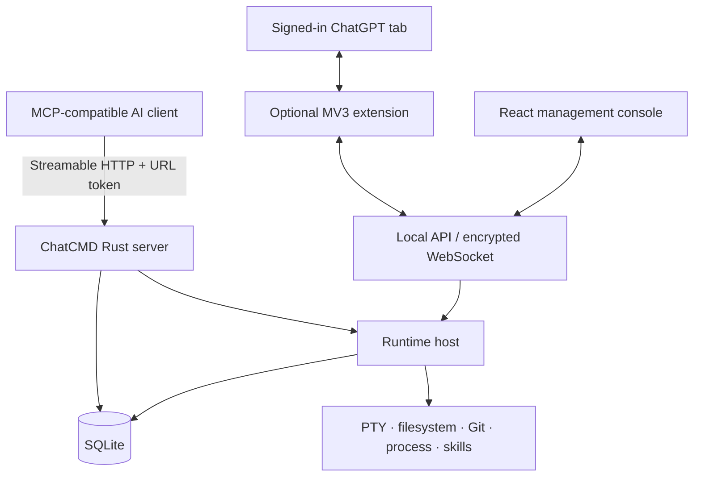

# Architecture

ChatCMD is a local-first Rust application with an embedded or separately served React UI. It exposes an authenticated MCP endpoint to AI clients and translates allowed tool calls into bounded local runtime operations.

## System context



## Repository layout

| Path | Responsibility |
| --- | --- |
| `src/` | Application startup, HTTP routes, local API, WebSocket, runtime orchestration, task lifecycle, and desktop tray. |
| `crates/chatcmd-core/` | Shared domain models, store traits, secret wrappers, identifiers, and contracts. |
| `crates/chatcmd-storage/` | SQLite repository, migrations, device identity, event writer, recovery, and legacy import. |
| `crates/chatcmd-runtime/` | Policy-aware filesystem, PTY shell, Git, process, workspace, and skill services. |
| `crates/chatcmd-mcp/` | MCP schemas, tool router, authentication/origin enforcement, request identity, and sub-agent sampling protocol. |
| `web/` | React/Vite management console, encrypted API client, real-time state, task UI, and tests. |
| `chatgpt-extension/` | Chromium Manifest V3 bridge for an existing ChatGPT browser session. |
| `scripts/` | Windows and macOS release packaging. |
| `docs/` | User, protocol, architecture, and maintenance documentation. |
| `plan/` | Design proposals for scalability, safety, and protocol evolution. |

## Startup lifecycle

1. `src/main.rs` reads bind, port, database, logging, and frontend configuration.
2. `chatcmd-storage` resolves the platform data path, opens SQLite, applies migrations, and restores stable device identity.
3. Startup recovery marks stale running tasks and terminal sessions as interrupted.
4. The current MCP tool catalog and permission preset are seeded into SQLite.
5. ChatCMD creates the policy engine and the workspace, shell, Git, process, and skill services.
6. `RuntimeHost` connects those services to task identity, approvals, sub-agents, persistence, and real-time events.
7. Axum mounts the MCP router, health endpoints, encrypted local management API, WebSocket, and frontend assets on one listener.
8. Release builds on Windows and macOS start the server behind a tray application; development builds run directly.

## MCP request flow

```text
POST /mcp/<token>
  -> host validation
  -> query-token rejection
  -> URL-token hash lookup
  -> enabled access profile + tool allowlist
  -> MCP schema validation
  -> server-derived agent/session identity
  -> RuntimeHost dispatch
  -> policy / approval / cancellation checks
  -> local service operation
  -> SQLite event persistence + WebSocket publication
  -> MCP result
```

The raw local profile secret is generated for one-time display and only a derived hash plus a short suffix are persisted. A separate token is generated for public plugin links. Public plugin tokens are stored in recoverable plaintext in the local SQLite database so the UI can reproduce the same public link, alongside a hash used for lookup. Every URL token is a bearer credential and must be handled like a password.

MCP tools are grouped into device, terminal, filesystem/workspace, Git, process, skill, task, and agent-orchestration capabilities. The server identity—not untrusted request fields—selects the effective access profile.

## Local management flow

The management UI communicates with `/api/local/*`. Requests require `X-ChatCmdClient: local-ui`; extension callbacks use the narrower `chatgpt-extension` marker. Health and version endpoints remain outside this protected route group.

The browser establishes an ephemeral P-256 ECDH session, derives an AES-256-GCM key with HKDF-SHA256, and encrypts local JSON request/response bodies. The WebSocket uses a similar per-connection handshake and rejects plaintext application frames after setup. HTTP associated data binds ciphertext to direction, method, full path/query, and response status.

This layer reduces casual exposure in browser network tooling. It is not a trusted-execution boundary: code running in the browser can observe plaintext before encryption or after decryption. The fixed handshake key is obfuscation, not a durable secret. See [ENCRYPTION_PROTOCOL.md](ENCRYPTION_PROTOCOL.md).

## Task and terminal lifecycle

- A user turn is correlated by access profile, logical MCP session, conversation scope, task ID, and turn ID.
- `agent_user_message` opens/correlates the turn; progress, plan questions, tools, sub-agents, and terminal activity append timeline events.
- Approval mode can pause a conversation or individual action for a local decision.
- Persistent PTY sessions expose sequence-based replay, resize, signals, input, resource metadata, and explicit close operations.
- Active operations register cancellation handles so a user can stop a tool, turn, task, or terminal.
- `agent_turn_complete` finalizes a turn after active work ends. A watchdog reconciles stale turns when the remote client omits finalization.
- Sub-agent records connect parent and child tasks. Host sampling is preferred; the optional browser extension can provide a bounded fallback when configured.

## Persistence

SQLite is the source of truth for:

- stable local device identity;
- settings and schema version;
- MCP access profiles, secret hashes, tool catalog, presets, and allowlists;
- tasks, logical sessions, turn bindings, approvals, and execution modes;
- terminal metadata and chunked output;
- timeline events and artifacts;
- workspace projects;
- ChatGPT bridge requests, conversation bindings, and message queue;
- sub-agent and fallback state;
- user-managed tunnel origins and public plugin-token hashes.

Migrations in `crates/chatcmd-storage/migrations/` are append-only once released. SQLite WAL supports concurrent readers and a serialized event writer batches persistent events. Cleanup settings can remove generated task data while retaining access profiles, workspace projects, and system configuration.

## Frontend

The React application uses:

- React Router for dashboard, tasks, sessions, access profiles, skills, and settings;
- an encrypted fetch wrapper for management API calls;
- an encrypted WebSocket provider for live events;
- xterm.js for interactive terminals;
- sanitized Markdown and Prism-based code rendering for task output;
- browser-local preferences for presentation choices, backed by server settings where appropriate.

Vite serves the development UI on port `5173` and proxies `/api` and `/ws` to port `8080`. Production builds can be served from `web/dist` or embedded into the Rust binary through the `embedded-web` feature.

## ChatGPT extension

The extension is optional and separate from MCP transport. It has permissions for tabs, storage, scripting, `chatgpt.com`, and loopback ChatCMD origins. It does not request cookie access.

It drives the visible ChatGPT DOM, tracks conversation/tab bindings, returns assistant output to ChatCMD, and can render local approval controls. Local callback origin validation only accepts HTTP `localhost` or `127.0.0.1`. Because the integration depends on third-party page structure, selector changes are an expected maintenance cost.

## Trust boundaries

| Boundary | Primary controls | Important limitation |
| --- | --- | --- |
| AI client → MCP | URL token, hashed lookup, enabled profile, tool allowlist, schema validation, origin/host policy | Anyone with the full URL has the profile's authority. |
| Runtime → filesystem/process | Canonical roots, structured arguments, policy decisions, approvals, limits, cancellation | Broadly configured roots or allow-all mode intentionally grant broad local power. |
| Browser → local API | Caller marker, loopback expectation, encrypted bodies, session reset | A compromised local browser or OS account can inspect plaintext. |
| Internet → public tunnel | Operator's HTTPS, access policy, firewall, and token secrecy | ChatCMD does not operate or secure the user's tunnel provider. |
| Extension → ChatGPT | Restricted host permissions, no cookie permission, explicit DOM bridge | Other extensions or page changes can interfere with the same tab. |
| Persistent storage | Local SQLite, profile-secret hashing, bounded event storage, cleanup | Public plugin tokens and application data are readable by the OS account and local administrators. |

Security-sensitive changes should be reviewed against [SECURITY.md](../SECURITY.md) and tested across authentication, authorization, path handling, cancellation, persistence, and browser boundaries.
